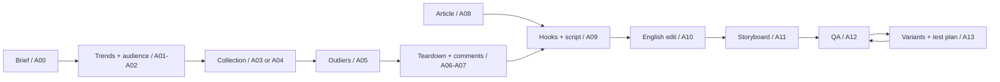

# Short-Form Content OS

**Turn scattered research into original short videos your team can actually produce.**

An English agent workflow for TikTok, Instagram Reels and YouTube Shorts: find relevant trends, identify account-level outliers, understand audience objections, write benefit-led scripts, hand off shots, and plan the next creative test.

**14 roles · 36 hook families · 4 script formats · Complete prompts · MIT**

[Start with the brief](templates/brief.md) · [Full handbook](docs/handbook.md) · [Agent prompts](prompts/README.md) · [Word handbook](docs/Short_Form_Content_OS_EN.docx)

## What you get

- A repeatable path from evidence to a finished script and production handoff.
- Full A00–A13 prompts: responsibilities, inputs, outputs and handoff instructions.
- Research routes for trends, audience fit, outliers, transcripts and comments.
- Reference-transfer and benefit-evidence maps that keep creative grounded in your product.
- 36 hook families, four formats, five body structures and ten article-adaptation frameworks.
- CSV templates for research, storyboards, experiments and feedback.
- A working example you can try without API keys.

This is an agent skill and operating playbook. Your host agent supplies reasoning and tools; research providers are optional external integrations. It does not ship a background scheduler, video renderer or automatic publisher.

## Start in five minutes

1. Copy [the brief](templates/brief.md) and fill in your product, buyer, evidence, channel, duration and goal.
2. Give your assistant [A00](prompts/A00-orchestrator.md) and the relevant [role prompts](prompts/README.md).
3. Ask for the requested deliverable. Use provided sources first; configure [research integrations](integrations.md) only when needed.
4. Review the script, proof requirements and storyboard. Iterate using actual metrics when available.

```text
Use $short-form-content-os with the supplied materials.
Mode: script_only
Audience: US independent coffee shop owners
Product: a reusable opening-shift checklist
Verified capability: staff can record and review completed opening tasks
Goal: download the checklist
Channel: Instagram Reels
Duration: 30 seconds
Output: 10 hooks, shortlist 3, one original English script and a storyboard
Research budget: 0; use only my attached product facts
Do not invent customer results or time savings.
```

See the [complete fictional example](examples/coffee-shop-checklist.md).

## Workflow



A supplied video, transcript or article can enter directly. A hook-only task stays small. Roles can run sequentially in one assistant; the repository does not launch 14 agents automatically.

## Install as a skill

Clone into the skills directory supported by your agent. For a default Codex setup:

```bash
git clone https://github.com/trsgogogo/short-form-content-os.git ~/.codex/skills/short-form-content-os
```

If you use a custom skills directory, substitute that path. Start a new session if required by your host. Invoke `$short-form-content-os`, or use the Markdown prompts without installation.

Upgrading from `north-america-video-creative`: the repository has expanded into this workflow. Update the existing checkout's origin and folder name to `short-form-content-os`; keep only one installed copy to avoid duplicate discovery. Your own local modifications should be committed or backed up before updating.

## Repository map

| Path | Purpose |
| --- | --- |
| [SKILL.md](SKILL.md) | Entry point and task routing |
| [prompts/](prompts/README.md) | Full role and standalone prompts |
| [docs/handbook.md](docs/handbook.md) | Complete English operating manual |
| [references/hooks.md](references/hooks.md) | 36 English hook families |
| [references/frameworks.md](references/frameworks.md) | Formats and adaptation frameworks |
| [templates/](templates/handoff-guide.md) | Brief and copy-ready handoff templates |
| [integrations.md](integrations.md) | Seven optional research Skills and setup boundaries |
| [examples/](examples/coffee-shop-checklist.md) | A worked, explicitly fictional creative package |

## Defaults you can override

Ten distinct hooks, shortlist three, one main script. Add two variants when iteration is included. Generate all 36 hook families or all four script formats only when requested. Use natural spoken English, a clear practical benefit, one CTA and real product proof.

A single metrics snapshot cannot establish recent growth. Missing metrics stay unknown. A transcript is not video observation. Creative examples are not evidence of revenue or savings, and the workflow does not guarantee virality.

## Contributing and license

Submit a focused issue or pull request with a reproducible example and expected behavior. Use shareable, redacted materials. Run `python3 scripts/validate.py` before proposing changes.

[MIT](LICENSE) for original repository content. See [source notes](references/source-mapping.md) and [integrations](integrations.md) for third-party boundaries. Private source archives and third-party Skill source files are not included in the public handbook.
